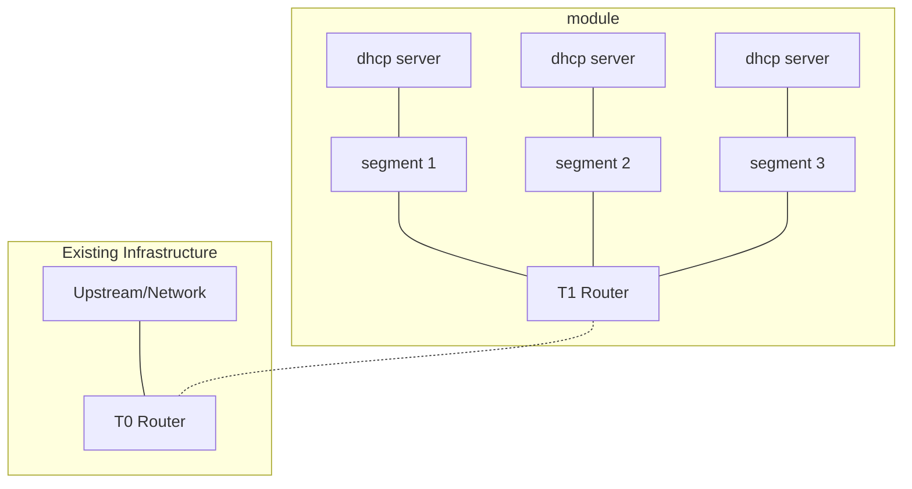

## Terraform vSphere Vault

This module will deploy the ground floor networking for Tenant management network. It will provide 3 networks

Each network deploys a per defined `public_subnets` and will deploy a DHCP subnet using the range of first usable to second last usable. The network gateway will be the first usable address and the DHCP server resides on last usable before broadcast.

